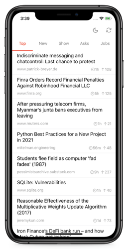
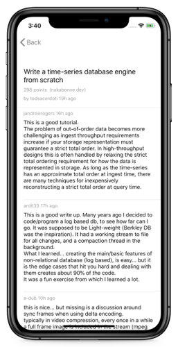
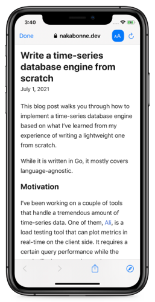
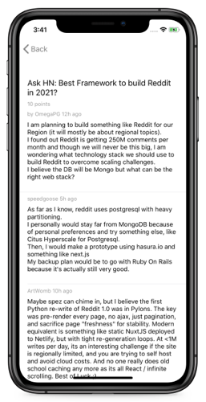
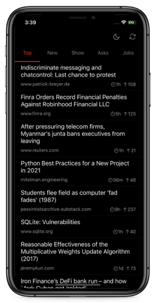
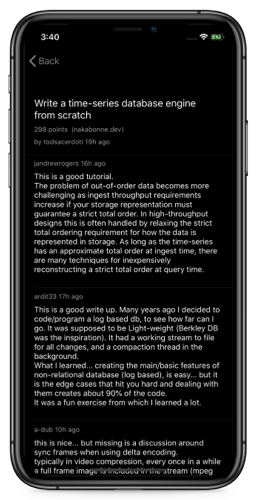

# Hacker-News-App
## Description
- A hacker news reader for iOS.
### Video: [Youtube Link](https://youtu.be/IuCv7aw9vEQ)

## Features
- Get top, new, show, asks, jobs stories
- Show how much time has passed and story's score
- Story's preview and show comments
- Share, add to reading list, read in safari
- Refresh all stories
- Infinite scroll and get next stories
- Light/dark theme
- Dynamically sized UITableViewCell

## Used
- Hacker News API
- MVVM + Coordinators
- AssemblyBuilder for creating modules
- RxSwift, RxCocoa
- Alamofire
- Without the use of storyboards
- AutoLayout; Xib
- UserDefaults
- SFSafariController
- UIKit
- CocoaPods

## Screenshots
     
